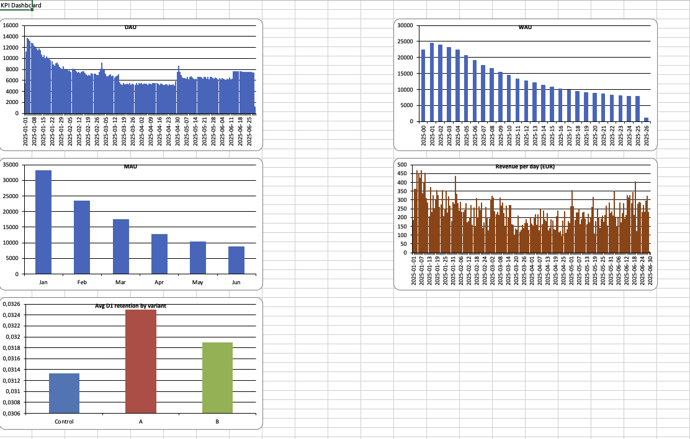
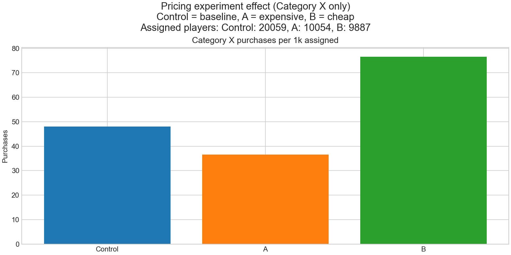

# Mock Game Analytics Pipeline

This repository contains a **self-contained data pipeline for a free-to-play mobile game**:

1. A **relational schema** for game telemetry (`schema.sql`).
2. A **synthetic data generator** that fills a SQLite database with realistic-ish player, session, event, purchase and A/B test data (`generate_mock_data.py`).
3. A **KPI export script** that computes core metrics like DAU/WAU/MAU, revenue and retention from the database into Excel (`export_kpis.py`).
4. An **Excel dashboard builder** that turns those KPIs into charts in a single workbook (`kpi_dashboard.py`).
5. A small **DB inspector** to explore the schema and tables (`inspect_db.py`).

The project is meant for **learning and demo purposes**: you can use it to e.g. to practice game analytics and/or build dashboards.

---

## Features

- **Realistic F2P schema**
  - `players`, `sessions`, `events`, `purchases`, `teams`, `team_memberships`, `experiment_assignments`, …
- **Configurable simulation**
  - Number of days, total players, DAU curve shape, churn behaviour, spend segments, etc.
- **Experiments / A/B tests**
  - Simple `shop_pricing_v1` pricing experiment with `Control`, `A`, `B` variants.
    - `Control`: default pricing for product category X
    - `A`: expensive pricing (appeals mainly to whales)
    - `B`: cheap pricing (appeals broadly, increases volume)
- **Core KPIs out of the box**
  - DAU per day  
  - WAU per week (calendar weeks)  
  - MAU per month  
  - Revenue per day  
  - Retention cohorts (D1 / D7 / D30) per experiment variant
- **Excel dashboard**
  - “One file” view of the key KPIs with line + bar charts:
    - DAU, WAU, MAU
    - Revenue per day (EUR)
    - Average D1 retention by variant for the A/B test

---

## Project structure

```text
schema.sql                 # SQLite schema for the mock game
generate_mock_data.py      # Creates mock_game2.db with synthetic telemetry
export_kpis.py             # Reads DB, exports KPIs into kpi_dashboard_data.xlsx
kpi_dashboard.py           # Builds kpi_dashboard_with_charts.xlsx from KPI data
inspect_db.py              # CLI tool to inspect tables, columns, sample rows

mock_game2.db              # (generated) SQLite DB with simulated data
kpi_dashboard_data.xlsx    # (generated) KPI tables (DAU/WAU/MAU/revenue/AB)
kpi_dashboard_with_charts.xlsx  # (generated) Excel dashboard with charts
```

Generated files will be recreated/overwritten when you re-run the scripts.

---

## Requirements

- Python 3.10+  
- Recommended packages (install via pip):

```bash
pip install pandas openpyxl xlsxwriter
```

Optional (for generating the experiment PNG plot):

```bash
pip install matplotlib
```

The scripts also use only standard library modules (`sqlite3`, `datetime`, `random`, `math`, `json`).

---

## How to run the pipeline

### 1. Generate the mock database

This will:

- Create (or overwrite) `mock_game2.db`
- Apply `schema.sql`
- Populate all tables with ~6 months of data by default

```bash
python generate_mock_data.py
```

You can adjust **data volume and behaviour** at the top of `generate_mock_data.py`:

```python
NUM_DAYS = 180        # length of simulation in days
N_PLAYERS = 40_000    # total number of players ever created
MAX_DAU   = 15_000    # peak daily active users
```

The generator will:

- Create players with:
  - Country, platform, timezone, engagement segment (`casual`, `midcore`, `heavy`)
  - Spend segment (`nonpayer`, `minnow`, `dolphin`, `whale`)
  - Simple churn model (most players churn within weeks, some “core” users stay long)
- Assign players to teams of varying sizes (small, medium, large).
- Assign each player into `shop_pricing_v1` experiment (`Control`, `A`, `B`).
  - This affects **spending behaviour & price** for product category X (not sessions/DAU/retention).
- Generate a DAU curve with:
  - Launch spike, early decay, patches, seasonal effects
- Generate sessions, events and purchases that depend on engagement & spend segment.

**Pricing experiment model (exact)**

The pricing experiment is implemented as a synthetic “category X” purchase stream:

- A fixed share of purchase opportunities are treated as category X: `CATEGORY_X_SHARE = 0.35`.
- Category X uses a base price draw (Control anchor) and then applies a variant multiplier:
  - Base price (EUR): one of `4.99` (55%), `9.99` (30%), `19.99` (15%).
  - Price multiplier by variant:
    - `Control`: `1.00`
    - `A` (expensive): `1.30`
    - `B` (cheap): `0.75`
- Purchase conversion is adjusted (relative to the baseline spend-segment purchase probability) by variant and spend segment:
  - Baseline purchase probability (unchanged by experiment): `minnow=0.01`, `dolphin=0.03`, `whale=0.10`.
  - Conversion multiplier for category X:
    - `Control`: `minnow=1.00`, `dolphin=1.00`, `whale=1.00`
    - `A`: `minnow=0.55`, `dolphin=0.85`, `whale=1.35`
    - `B`: `minnow=1.55`, `dolphin=1.35`, `whale=1.10`
- Any non-category-X purchases use the baseline catalogue and are **not** affected by the experiment.

Notes:

- This setup is intentionally designed so `A` shifts revenue toward whales, and `B` increases purchase volume across the population.
- Randomness is reproducible via `RANDOM_SEED` in `generate_mock_data.py`.

Prices are stored as **integer cents** (`price_eur` field), e.g. 4.99 EUR → `499`.

---

## Mathematical models used (mock data generation)

All stochastic behaviour is implemented in `generate_mock_data.py` using Python’s standard library RNG.

**Libraries**

- Standard library: `random`, `math`, `datetime`, `sqlite3`, `json`, `pathlib`
- No NumPy/SciPy are used for generation.

**Models (high level)**

- **DAU curve** (post-launch decay + seasonality + patch spikes):
  - Base curve (exponential decay to a floor):
    $$\mathrm{base}(t)=f + h\,e^{-t/\tau}$$
    with $f=0.6$, $h=0.8$, and $\tau=\max(7, 0.1\cdot N_{\mathrm{days}})$, where $N_{\mathrm{days}}$ is the number of simulated days.
  - Seasonality and patches are multiplicative, plus small noise $U\sim\mathrm{Unif}(0.95,1.05)$.
  - Finally the curve is normalised so its max equals `MAX_DAU`.

- **Player creation over time** (mixture distribution):
  - Creation day is sampled from a mixture of uniform ranges to create a launch spike + tail:
    60% in days 0–3, 25% in 4–30, 10% in 31–90, 5% in 91–end.

- **Churn / lifetime** (mixture model):
  - With probability 0.15, a player is “core” and does not churn within the simulated window.
  - Otherwise lifetime $L$ is exponential:
    $$L\sim\mathrm{Exponential}(\lambda=1/45)$$
    implemented via `random.expovariate(1/45)` and discretised to integer days.

- **Sessions per active player per day** (segment-conditional):
  - `casual` and `midcore`: categorical draws (via `random.choices`).
  - `heavy`: Pareto-like draw:
    $$X\sim\mathrm{Pareto}(\alpha=2)$$
    implemented via `random.paretovariate(2.0)` and capped to a max of 10 sessions.

- **Session duration** (lognormal):
  - $$D\sim\mathrm{LogNormal}(\mu=\ln(600),\,\sigma=0.7)$$
    implemented via `random.lognormvariate(math.log(600), 0.7)`, then clamped to at least 60 seconds.

- **Matches / outcomes / currency deltas**:
  - Match counts, game mode, and outcomes are categorical.
  - Match durations are uniform over 60–900 seconds.
  - Currency deltas are sampled from simple outcome-dependent integer ranges.

- **Purchases** (Bernoulli trials + categorical catalogue):
  - Baseline purchase probability per opportunity depends on spend segment (minnow/dolphin/whale).
  - If a purchase happens, product is chosen from a weighted catalogue.

- **Pricing experiment (`shop_pricing_v1`)** (Category X only):
  - Variant assignment is categorical: Control 50%, A 25%, B 25%.
  - Each purchase opportunity is Category X with probability `CATEGORY_X_SHARE`.
  - If Category X, conversion probability is scaled by variant and spend segment:
    $$p_{\mathrm{eff}}=p_{\mathrm{base}}\cdot m(v, s)$$
  - If Category X, price is a categorical base price multiplied by a variant multiplier:
    $$p=p_{0}\cdot \alpha(v)$$
  - Non-Category-X purchases are unaffected by the experiment.

---

### 2. Inspect the database (optional)

To see what was created:

```bash
python inspect_db.py          # defaults to mock_game2.db
# or
python inspect_db.py path/to/your.db
```

This prints, for each table:

- Column definitions
- Row count
- One sample row

---

### 3. Export KPIs to Excel

This script reads from `mock_game2.db` and produces `kpi_dashboard_data.xlsx` with multiple sheets:

- `DAU_daily`  
- `WAU_weekly`  
- `MAU_monthly`  
- `Revenue_daily`  
- `Revenue_by_variant_daily`
- `AB_retention`

Run:

```bash
python export_kpis.py
```

What it computes:

- **DAU per day** (`DAU_daily`)
  - `day` (YYYY-MM-DD)
  - `dau` (distinct active players)

- **WAU per calendar week** (`WAU_weekly`)
  - `week` (YYYY-WW)
  - `wau` (distinct active players in that week)

- **MAU per month** (`MAU_monthly`)
  - `month` (YYYY-MM)
  - `mau` (distinct active players in that month)

- **Revenue per day** (`Revenue_daily`)
  - `day`
  - `revenue_eur` (sum of `price_eur` converted from cents to euros)

- **Revenue per day by variant** (`Revenue_by_variant_daily`)
  - `day`
  - `Control`, `A`, `B` (EUR)

- **Experiment retention cohorts** (`AB_retention`)
  - One row per `(experiment_name, variant, cohort_first_day)`:
    - `cohort_size`
    - `day1_active`, `day7_active`, `day30_active`
    - `d1_retention`, `d7_retention`, `d30_retention` (ratios)

---

### 4. Build the Excel dashboard

This script takes `kpi_dashboard_data.xlsx` and creates `kpi_dashboard_with_charts.xlsx`.

```bash
python kpi_dashboard.py
```

It:

1. Reads the KPI sheets.
2. Adds a month-name column to MAU (e.g. `Jan`, `Feb`, …).
3. Creates (or reuses) a `Dashboard` sheet.
4. Adds charts to the dashboard (mix of line + bar charts):

  - **DAU** (per day)
   - **WAU** (per week)
   - **MAU** (per month, with month names on x-axis)
  - **Revenue per day (EUR)**
  - **Revenue per day by variant (EUR)**
  - **Avg D1 retention by variant** (one bar each for `Control`, `A`, `B`)

Finally open `kpi_dashboard_with_charts.xlsx` in Excel (or compatible) to view the charts.



---

## Optional: Plot the pricing experiment (PNG)

If you want a quick visual that highlights the **Control/A/B behavior** for the pricing experiment
(note: the experiment affects **Category X purchases only**), run:

```bash
python plot_pricing_experiment.py
```

This writes `pricing_experiment_effects.png` with:

- Category X purchases per 1k assigned players by variant



---

## Data model overview

Very briefly, the main tables in `schema.sql`:

- **players**
  - Player profile & acquisition info (`platform`, `country_code`, `time_zone`, etc.)
- **teams** & **team_memberships**
  - Simple team/guild system: team creation time, tier, max members, leaders.
- **sessions**
  - One row per play session:
    - `session_start_utc`, `session_end_utc`, `duration_sec`
    - `country_code`, `platform`, `entry_point`, `season_id`, etc.
- **events**
  - Telemetry events tied to sessions:
    - Match start/end, `game_mode`, `match_outcome`, `level`
    - Soft/hard currency deltas
    - JSON metadata for extensibility
- **purchases**
  - IAPs with:
    - `product_id`, `product_type`
    - `price_local`, `price_eur` (cents), `currency_code`
    - Currency grants (soft/hard)
- **experiment_assignments**
  - Assigns each player to experimental variants (`Control`, `A`, `B`) for `shop_pricing_v1`.

---

## Customising / extending

Ideas for extensions:

- Change knobs in `generate_mock_data.py` to simulate:
  - A bigger/smaller game.
  - Different churn patterns or DAU shapes.
- Add new experiments (e.g. onboarding, live ops events) and compare retention/revenue.
- Extend `export_kpis.py` with:
  - ARPU
  - Platform or country splits
- Add more charts to `kpi_dashboard.py`:
  - Revenue per month
  - Country/platform breakdowns

---

## License

Licensed under the MIT License.
